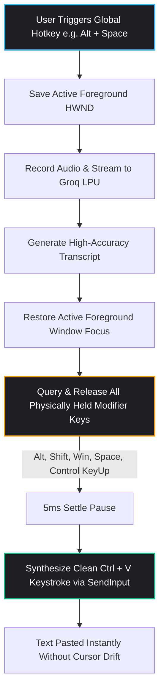

# 🚀 Rusper v0.2.0 Release Notes

> **Release Date**: August 2026  
> **Target OS**: Windows 10 / 11 (x64, ARM64)  
> **License**: AGPLv3 + Trademark  

---

## 🌟 Executive Overview

**Rusper v0.2.0** represents a major evolutionary leap for the open-source, zero-subscription AI voice dictation operating companion. This release delivers a completely redesigned **Apple-inspired glassmorphism Dashboard**, an intelligent **Custom Vocabulary & Phonetic Dictionary Engine**, real-time **App-Aware Context Adaptation**, a live **dB Audio VU Meter with Microphone Diagnostics**, and a bulletproof **Windows Input Injection Engine** that eliminates hotkey traps and cursor drift across all desktop applications.

Whether you are writing code in VS Code, drafting emails in Outlook, chatting on Slack, or taking notes in Obsidian, Rusper v0.2.0 delivers instantaneous voice-to-text at **200+ WPM with sub-300ms latency** using your own free Groq API key.

---

## 📋 Table of Contents

1. [🎨 Apple Glassmorphic Design System Overhaul](#1--apple-glassmorphic-design-system-overhaul)
2. [📚 Custom Vocabulary & Phonetic Dictionary](#2--custom-vocabulary--phonetic-dictionary)
3. [🧠 App-Aware Context Intelligence](#3--app-aware-context-intelligence)
4. [🎙️ High-Fidelity Audio Engine & Live dB VU Meter](#4--high-fidelity-audio-engine--live-db-vu-meter)
5. [⌨️ Bulletproof Windows Input Injection & Global Hotkeys](#5--bulletproof-windows-input-injection--global-hotkeys)
6. [🧠 Multi-Persona Prompt Engineering Engine](#6--multi-persona-prompt-engineering-engine)
7. [🎛️ Floating HUD & Push-to-Talk Capsule Polish](#7--floating-hud--push-to-talk-capsule-polish)
8. [⚡ Performance, Privacy & Architecture](#8--performance-privacy--architecture)
9. [🐛 Complete Bug Fixes & Stability Improvements](#9--complete-bug-fixes--stability-improvements)
10. [📦 Installation & Upgrade Instructions](#10--installation--upgrade-instructions)

---

## 1. 🎨 Apple Glassmorphic Design System Overhaul

The entire Rusper Dashboard and overlay system have been re-engineered from the ground up to bring Apple's fluid design language, physical materials, and spatial consistency to the Windows desktop.

```
┌─────────────────────────────────────────────────────────────────────────────────────────┐
│  Rusper                                                                    Settings     │
├───────────────────────┬─────────────────────────────────────────────────────────────────┤
│  ⚡ AI Engine & Keys   │  ⚡ AI Engine & Custom API Key                                  │
│  🎙️ Audio & Devices    │  Direct BYOK connection to Groq LPUs.                           │
│  🎯 Dictation Modes   │                                                                 │
│  📚 Custom Vocabulary │  ┌───────────────────────────────────────────────────────────┐  │
│  ⌨️ Hotkeys & Overlay │  │ 🔑 Groq API Key (gsk_...)                           [Save]│  │
│  🧠 Prompt Engine     │  └───────────────────────────────────────────────────────────┘  │
│  💡 Why Rusper        │                                                                 │
└───────────────────────┴─────────────────────────────────────────────────────────────────┘
```

### Key UI Features:
* **Translucent Materials & Layered Depth**: Subtle `1px` translucent borders (`border-white/[0.06]`), deep dark backdrop canvases (`#070709` / `#0f0f14`), and soft ambient specular lighting.
* **macOS-Style Split-View Navigation**: 7 dedicated sidebar categories with fluid spring animations powered by `framer-motion` (`stiffness: 350`, `damping: 30`).
* **Minimal Vector Check-Circle Indicators**: Clean SVG check indicators for active dictation mode selection (`check-circle.svg`), replacing loud accents with understated elegance.
* **Refined Typography Hierarchy**:
  * **Display Titles**: *Instrument Serif* italic headers.
  * **Interface Text**: Clean *Inter* typography with optical sizing and proportional leading.
  * **Code & Tokens**: High-contrast *JetBrains Mono* for shortcuts, API keys, and logs.

---

## 2. 📚 Custom Vocabulary & Phonetic Dictionary

Voice engines often struggle with developer frameworks, company names, medical acronyms, or unique brand terms. Rusper v0.2.0 introduces a built-in **Custom Vocabulary Engine** (`src-tauri/src/vocabulary.rs`).

### Capabilities:
* **Custom Keyword Enforcement**: Define proprietary terms (e.g. `PostgreSQL`, `TailwindCSS`, `Kubernetes`, `GraphQL`, `Supabase`, `Rusper`).
* **Phonetic "Sounds-Like" Matching**: Map misheard phonetic phrases directly to their correct spelling (e.g., *"rust per"* $\rightarrow$ `Rusper`, *"sequel"* $\rightarrow$ `SQL`, *"dockerized"* $\rightarrow$ `Dockerized`).
* **One-Click Curated Presets**:
  * 💻 **Developer / Tech Stack**: 25+ essential programming tools, frameworks, and database terms.
  * 🏥 **Medical & Scientific**: Common clinical and pharmaceutical nomenclature.
  * ⚖️ **Legal & Corporate**: Standard corporate clauses, enterprise abbreviations, and compliance terms.
* **Instant Search & Toggle**: Real-time filtering, individual term enable/disable switches, and inline deletion.

---

## 3. 🧠 App-Aware Context Intelligence

Rusper is now aware of the application you are currently typing in and dynamically formats your dictation to suit your workflow (`src-tauri/src/context.rs`).

### How It Works:
1. When you trigger dictation, Rusper queries Windows native APIs (`GetForegroundWindow`, `GetWindowThreadProcessId`, `QueryFullProcessImageNameW`) to identify the target application.
2. The active app context is classified into an environment category:
   * 💻 **Code Editors / IDEs** (`code.exe`, `cursor.exe`, `devenv.exe`, `idea64.exe`, `nvim.exe`) $\rightarrow$ Preserves code identifiers, variable casing (`camelCase`, `snake_case`), and formats code references with markdown backticks.
   * 💬 **Chat & Collaboration** (`slack.exe`, `discord.exe`, `teams.exe`, `telegram.exe`) $\rightarrow$ Concise, conversational, natural workplace formatting.
   * 🌐 **Browsers & Search** (`chrome.exe`, `msedge.exe`, `firefox.exe`, `brave.exe`) $\rightarrow$ Clean query syntax and search-optimized structure.
   * 📄 **Writing & Documents** (`word.exe`, `obsidian.exe`, `notion.exe`) $\rightarrow$ Full punctuation, rich paragraphs, and executive structure.
   * 🖥️ **Terminals & Shells** (`powershell.exe`, `cmd.exe`, `windowsterminal.exe`, `alacritty.exe`) $\rightarrow$ Direct raw CLI command synthesis.
3. **Live Context Preview**: The Dashboard includes a real-time context inspector displaying your active window title, process name, and active formatting rules.

---

## 4. 🎙️ High-Fidelity Audio Engine & Live dB VU Meter

The audio capture pipeline has been enhanced for studio-grade reliability and visual feedback.

### Enhancements:
* **Real-time Live Audio VU Meter**: An interactive, dynamic decibel volume meter in the Dashboard lets you test your microphone, monitor input gain, and prevent clipping before recording.
* **Dynamic Audio Device Selection**: Automatically enumerates all connected Windows WASAPI input devices and allows seamless switching without restarting the application.
* **16kHz Resampling Engine**: High-fidelity mono PCM capture tailored specifically for OpenAI Whisper's acoustic model.
* **Built-in Safety Protections**:
  * ⏱️ **90-Second Max Duration Protection**: Automatically wraps up and processes audio to avoid runaway background recordings.
  * 🔇 **15-Second Silence Detection**: Automatically pauses dictation if no voice input is detected.

---

## 5. ⌨️ Bulletproof Windows Input Injection & Global Hotkeys

One of the most critical fixes in v0.2.0 is a complete rewrite of how Rusper interacts with the Windows OS input queue (`src-tauri/src/injector.rs`).



### What Was Fixed:
* **Complete Physical Modifier Key Release**: When using trigger keys containing `Space`, `Alt`, `Shift`, or `Win`, previous versions could allow Windows to interpret held hardware keys as printable `' '` characters, causing text cursors to run across editors and overwrite text. v0.2.0 queries all down keys (`VK_SPACE`, `VK_MENU`, `VK_SHIFT`, `VK_LWIN`, `VK_RWIN`, `VK_CONTROL`, `A..Z`, `0..9`) and sends synthetic `KEYUP` events with a 5ms settle pause before pasting.
* **Interactive Mode Repeat Debounce**: Added a 400ms debounce threshold to prevent rapid auto-repeat keystrokes from prematurely stopping interactive recordings.
* **Global Hotkey Presets**:
  * `ScrollLock` *(Default single-key trigger)*
  * `Pause / Break`
  * `Insert`
  * `F8`, `F9`, `F12`
  * `Alt + Space`
  * `Ctrl + Shift + Space`
  * `Ctrl + Alt + D`
  * `Ctrl + Alt + S`

---

## 6. 🧠 Multi-Persona Prompt Engineering Engine

Rusper v0.2.0 includes 5 pre-tuned system prompt personas designed to adapt to any writing style:

| Persona | Purpose | Best For |
| :--- | :--- | :--- |
| 🔥 **Smart Self-Correction (Banger)** *(Default)* | Strips emotional venting, rambles, and filler words while resolving mid-sentence plan revisions into crisp, publication-ready text. | Daily writing, notes, Slack, brainstorming |
| ✉️ **Professional Email & Workplace** | Structures rambles into clean corporate emails with proper greetings, bullet points, and sign-offs. | Outlook, Gmail, Teams, client updates |
| 💻 **Developer Specification** | Preserves code syntax, variable names, and auto-detects spoken length commands (*"make it 50 words"*, *"enhance prompt"*). | VS Code, Cursor, GitHub PRs, AI prompting |
| 📝 **Executive Summary & Action Items** | Extracts key decisions, summary points, and action items as markdown checklists. | Meeting notes, standup updates, summaries |
| ✍️ **Clean Verbatim** | Minimal polish mode: fixes punctuation and stutters while keeping 100% of your exact words and phrasing intact. | Verbatim quotes, legal dictation, transcripts |

---

## 7. 🎛️ Floating HUD & Push-to-Talk Capsule Polish

* **Dual Operating Modes**:
  1. **Push-to-Talk Capsule**: Hold trigger while speaking; release to auto-paste directly into your active field with zero clicks.
  2. **Interactive Review Card**: Tap trigger to record; floating card displays transcript with quick actions (`Enter` to paste, `Esc` to cancel, `R` to redo, `Ctrl+Z` to undo).
* **Zero Flicker Window Resizing**: Synchronous Tauri v2 window geometry transitions (`sync_window_size`) with transparent webview background attributes to prevent visual white flashes or clipping borders.
* **Screen Placement Options**: Position your floating HUD across 9 screen anchor zones (`bottom-center`, `top-center`, `bottom-right`, `center`, etc.).

---

## 8. ⚡ Performance, Privacy & Architecture

| Metric / Attribute | Rusper v0.2.0 | Traditional SaaS Dictation |
| :--- | :--- | :--- |
| **Pricing** | **100% Free Forever** (BYOK) | $12 – $20 / month recurring |
| **Transcription Latency** | **Sub-300ms** (via Groq LPUs) | 500ms – 1200ms |
| **Speech Model** | **OpenAI Whisper Large v3 Turbo** | Proprietary / Downscaled Whisper |
| **RAM Footprint** | **~25 MB** (Rust native + WASAPI) | 350+ MB (Electron) |
| **Audio Privacy** | **Direct to Groq endpoint via your key** | Stored on third-party cloud servers |
| **Platform Integration** | **Native Windows 10/11 x64/ARM64** | Web-wrapper |

---

## 9. 🐛 Complete Bug Fixes & Stability Improvements

* ⌨️ **Fixed Global Hotkey Key Sticking**: All modifier and alphanumeric key states are safely sanitized prior to clipboard injection.
* 🔄 **Fixed Interactive Auto-Repeat Bug**: Holding the trigger in interactive mode no longer triggers premature stop events.
* 🎨 **Fixed UI Popover White Flash**: Resolved WebView2 default background color initialization by setting `WEBVIEW2_DEFAULT_BACKGROUND_COLOR=0`.
* 🛡️ **Fixed Empty Speech Hallucination**: Upgraded `is_meaningful_speech` filter to prevent Whisper hallucination loops on silence or background noise.
* 🏷️ **Cleaned Header Branding**: Removed redundant version pill badges from the header for a cleaner top-level dashboard.

---

## 10. 📦 Installation & Setup Files

> 📥 **Download Setup Files**: I have attached the setup files down below in the release assets so you can download and install Rusper v0.2.0 easily with a single click!

### Quick Install:
1. Download the attached **`Rusper-Setup-0.2.0.exe`** (or `.msi`) installer directly from the assets section below.
2. Run the installer to install or automatically upgrade your existing Rusper app.
3. *(If the Windows SmartScreen dialog appears, click **More info** → **Run anyway**)*.
4. Launch Rusper from your Start Menu or Desktop shortcut. Your saved Groq API key, custom vocabulary, and hotkeys will be automatically preserved.

### Building from Source:
```powershell
# Clone repository
git clone https://github.com/ajinkya-cell/flow-dictate.git
cd flow-dictate

# Install dependencies
npm install

# Run in development mode
npm run tauri dev

# Build release installer
npm run tauri build
```

---

<p align="center">
  <strong>Crafted with ❤️ using Rust, Tauri v2, React, and Groq LPUs.</strong><br>
  <em>Speak freely. Type effortlessly.</em>
</p>
